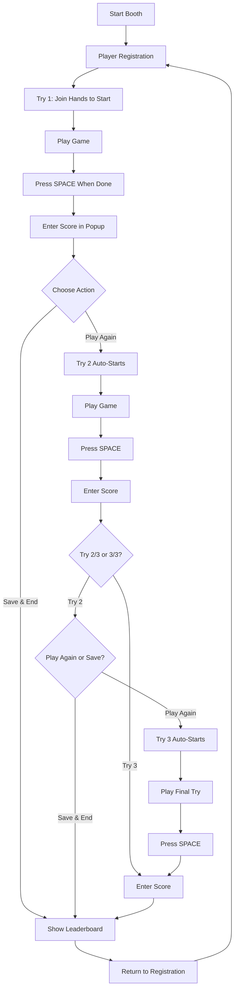

# 🎮 Subway Surfer Booth System

**A pose-controlled gaming booth with player registration, manual score tracking, and leaderboard display.**

Perfect for events, exhibitions, and interactive installations!

---

## ✨ Features

- ✅ **Pose Control** - Play Subway Surfers using body movements (via webcam)
- ✅ **Player Registration** - Collect player info (name, email, phone, consent)
- ✅ **3 Tries Per Player** - Fair gameplay with multiple attempts
- ✅ **Manual Score Entry** - Reliable score tracking with modern UI
- ✅ **Play Again / Save & End** - Smooth flow between tries
- ✅ **Leaderboard Display** - Beautiful top-3 display after each session
- ✅ **Data Export** - All scores saved to CSV for analysis
- ✅ **Continuous Loop** - Ready for next player automatically

---

## 🚀 Quick Start

### Prerequisites

- **Python 3.10+**
- **Webcam**
- **Subway Surfers** (browser or desktop version)

### Installation

1. **Clone repository:**
   ```bash
   cd OpenCV_Gesture
   ```

2. **Create virtual environment (recommended):**
   ```bash
   python -m venv gest
   gest\Scripts\activate  # Windows
   ```

3. **Install dependencies:**
   ```bash
   pip install opencv-python mediapipe pyautogui pandas
   ```

4. **Run the booth:**
   ```bash
   python main.py
   ```

That's it! 🎉

---

## 🎯 How to Use

### For Players

1. **Register** - Fill out the registration form with your info
2. **Join Hands** - Bring your hands together to start Try 1
3. **Play** - Use pose gestures to control the game:
   - **Tilt left/right** - Move lanes
   - **Jump** - Raise hands above shoulders
   - **Crouch** - Lower body
4. **Press SPACE** - When try ends, press SPACE on webcam window
5. **Enter Score** - Type your final score in the popup
6. **Choose Action:**
   - **Play Again** - Immediately start next try
   - **Save & End** - End session early
7. **Repeat** - Complete all 3 tries (or end early)
8. **View Leaderboard** - See if you made top 3!

### For Operators

- **Start booth:** `python main.py`
- **Exit:** Close registration form or press `Ctrl+C` in terminal
- **View data:** Open `scores.csv` in Excel/Google Sheets
- **Debug:** Check terminal output for any issues

---

## 🎮 Gameplay Controls

| Gesture | Action |
|---------|--------|
| **Join hands together** | Start try |
| **Lean/tilt left** | Move to left lane |
| **Stand center** | Move to center lane |
| **Lean/tilt right** | Move to right lane |
| **Raise hands high** | Jump |
| **Crouch down** | Slide/duck |
| **Press SPACE** | End try & enter score |

---

## 📊 Workflow



---

## 🎨 UI Screenshots

### Score Entry Popup (Modern Design)
- **Dark theme** with gradient backgrounds
- **Progress indicator** (●●○ for Try 2/3)
- **Large score input** (48pt font, cyan highlight)
- **Action buttons:**
  - **Green "Play Again"** button (Tries 1-2)
  - **Red "Save & End"** button (always available)

### Leaderboard (Modern Design)
- **Top 3 players** with medal emojis (🥇🥈🥉)
- **Gradient borders** for each rank
- **Large trophy** at the top
- **Player names** and **high scores**
- **Auto-closes** after 5 seconds

---

## ⚙️ Configuration

Edit `config.py` to customize:

```python
# Session settings
MAX_TRIES = 3  # Tries per player

# Display durations
LEADERBOARD_DISPLAY_DURATION = 5  # Seconds
THANK_YOU_DURATION = 3

# Registration requirements
REQUIRE_NAME = True
REQUIRE_EMAIL = True
REQUIRE_PHONE = True

# Score entry (DO NOT CHANGE)
USE_MANUAL_SCORE_ENTRY = True  # Manual entry required for browser games
```

---

## 📁 File Structure

```
OpenCV_Gesture/
├── main.py                    # Main booth orchestrator
├── Subway.py                  # Pose-controlled game logic
├── registration_form.py       # Player registration GUI
├── manual_score_entry.py      # Modern score entry popup
├── Leaderboard.py             # Modern leaderboard display
├── data_manager.py            # CSV data persistence
├── window_utils.py            # Window detection utilities
├── config.py                  # System configuration
├── requirements.txt           # Python dependencies
├── scores.csv                 # Generated player data
└── tests/                     # Test files and utilities
    ├── README.md              # Tests documentation
    ├── calibrate_score_region.py  # Score region calibration tool
    ├── debug_score_detection.py   # OCR debugging tool
    ├── test_score_and_leaderboard.py
    ├── test_system.py
    └── test_window_utils.py
```

---

## 📊 Data Output

All player data is saved to **`scores.csv`**:

| Column | Description |
|--------|-------------|
| `Timestamp` | Session date/time |
| `Name` | Player name |
| `Email` | Player email |
| `Phone` | Player phone |
| `Contact_Permission` | Marketing consent (Yes/No) |
| `Try_1_Score` | Score from try 1 |
| `Try_2_Score` | Score from try 2 |
| `Try_3_Score` | Score from try 3 |
| `High_Score` | Highest of 3 tries |

**Export Tips:**
- Open in Excel/Google Sheets
- Filter by date range
- Sort by High_Score descending
- Export emails for marketing (with consent)

---

## 🐛 Troubleshooting

### Webcam not working
- Check no other app is using the webcam
- Verify webcam permissions in Windows settings
- Try unplugging/replugging USB webcam

### Popup doesn't appear
- Make sure **webcam window** is focused when pressing SPACE
- Check `config.py`: `USE_MANUAL_SCORE_ENTRY = True`
- Look for errors in terminal

### Auto-start issues
- Popup appears immediately after "Play Again"
  - Fixed! There's now a 2-second cooldown
- Game doesn't restart
  - Make sure Subway Surfers window is active

### Leaderboard not showing
- Check that `scores.csv` exists and has data
- Verify `LEADERBOARD_DISPLAY_DURATION` in config
- Check terminal for errors

---

## 🎯 Tips for Best Results

1. **Good Lighting** - Ensure webcam has clear view of player
2. **Clear Space** - Player needs room to move left/right
3. **Calibrate** - Test pose detection before event
4. **Clear Instructions** - Show players the gesture controls
5. **Monitor Booth** - Keep eye on system during events
6. **Backup Data** - Periodically backup `scores.csv`

---

## 🔧 Advanced

### Testing Individual Components

```bash
# Test score entry popup
python manual_score_entry.py

# Test leaderboard
python Leaderboard.py

# Test registration form
python registration_form.py

# Test pose detection only
python Subway.py

# Calibration and debugging (in tests folder)
python tests/calibrate_score_region.py
python tests/debug_score_detection.py
```

### Customizing Themes

Colors are in the Python files:
- **Score Entry:** `manual_score_entry.py` (lines 30-40)
- **Leaderboard:** `Leaderboard.py` (lines 20-30)

Change hex colors like `#1a1a2e` to customize.

---

## 💡 FAQ

**Q: Can I use this without Subway Surfers?**  
A: Partially. The pose detection works standalone, but score tracking is designed for Subway Surfers.

**Q: Does OCR work?**  
A: No. OCR is disabled because browser games use hardware acceleration that breaks screen capture. Manual entry is more reliable.

**Q: Can players skip score entry?**  
A: Yes, but score defaults to 0. They must still choose "Play Again" or "Save & End".

**Q: How do I reset the leaderboard?**  
A: Delete or rename `scores.csv`. New file will be created automatically.

---

## 📝 License

This project is for educational/event use. Respect Subway Surfers' intellectual property.

---

## 🙏 Credits

- **MediaPipe** - Pose detection
- **OpenCV** - Computer vision
- **PyAutoGUI** - Game control simulation

---

**Enjoy your booth! 🎮🏆**
